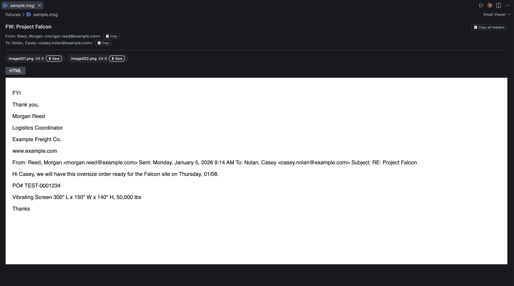
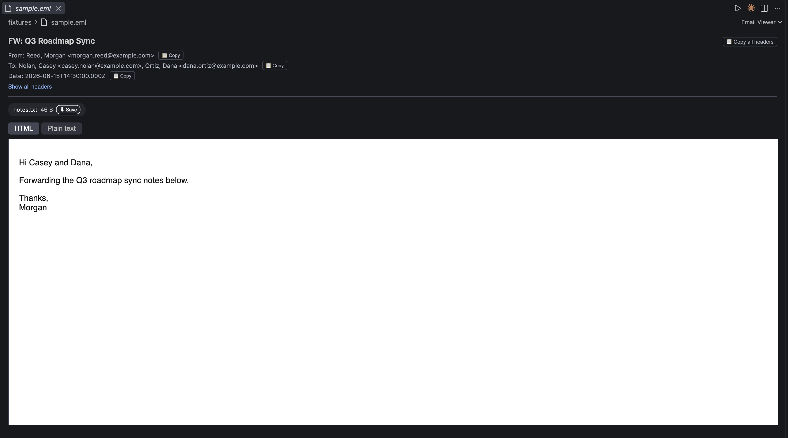
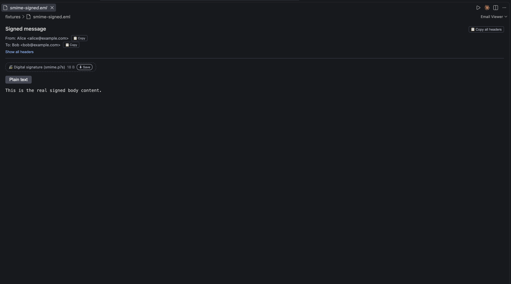
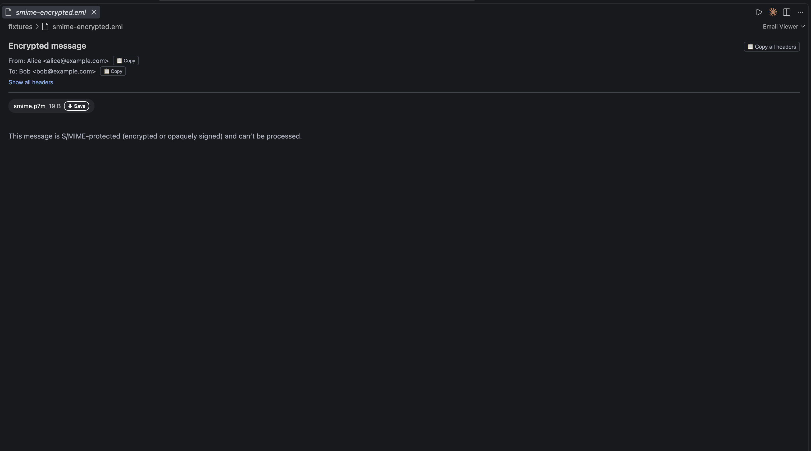

# MailPeek

A VS Code extension that opens `.msg` and `.eml` files directly in the editor — headers, body, and attachments — with forwarded/nested emails drilling down into their own tabs instead of leaving VS Code.



## What it does

- Opens `.msg` and `.eml` files directly in the editor: a header card (subject, from, to, cc, date — each copyable), the HTML or plain-text body (with an RTF-body fallback for `.msg`), and an attachment listing.
- Nested `.msg`/`.eml` attachments (forwarded emails) drill down into their own tab instead of leaving VS Code.
- Collapses long quoted/forwarded reply chains behind a toggle by default — configurable via the `mailpeek.collapseQuotedText` setting.
- Matches your VS Code theme and is keyboard/screen-reader accessible.
- Handles formats no parser here actually decodes with a clear, honest fallback instead of failing silently: TNEF/winmail.dat shows as a plain attachment, S/MIME signed mail shows its real body with the signature labeled distinctly, and S/MIME encrypted mail shows an explanatory notice.

## Screenshots

| `.eml` with attachments and quoted-content toggles | S/MIME signed (signature labeled distinctly)                  | S/MIME encrypted (explanatory notice)                               |
| ---------------------------------------------------- | ------------------------------------------------------------- | ------------------------------------------------------------------- |
|     |  |  |

## Privacy

Everything is parsed locally in the extension host. No email content, headers, or attachments are transmitted anywhere. Remote images and external resources referenced by an email's HTML body are never loaded.

## Development

Not yet published to the Marketplace (see [docs/plans/publish_to_marketplace.md](docs/plans/publish_to_marketplace.md)) — build and try it locally:

```bash
cd extension
npm install
```

**Iterate on the code**: `npm run compile` (or `npm run watch` for incremental rebuilds), then press `F5` in VS Code (with `extension/` open, or the repo root — `launch.json` points at `extension/`) to launch an Extension Development Host, and open one of the sample files in `data/*.msg`.

**Just try it**: `npm run package`, then `code --install-extension mailpeek-0.0.1.vsix --force`. Reload VS Code (`Cmd+Shift+P` → "Developer: Reload Window") or restart it, then open any `.msg` or `.eml` file — it opens directly in the MailPeek viewer. Re-run the same two commands to pick up a newer build.
